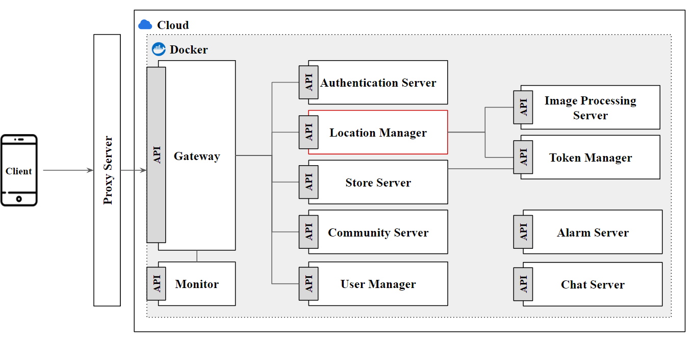
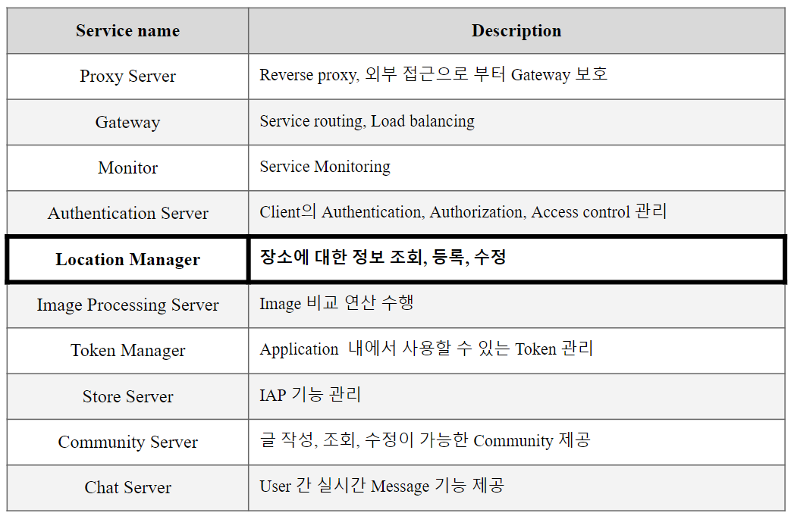

# Capstone Design Project / Any Where Map
This is the map-specific repository for AWM v2.

## 0. Introduction to Location Manager
Provides functionality for viewing information about a venue, registering, modifying, etc.  
For more information about the API, DB, and more, see the documentation in the '/doc' folder.

## 1. Repository Classification
|Repository|Description|URL|
|:---|:---|:---|
|awm-v2-backend-meta|You can view all service information for AWM-V2.|[link](https://github.com/ahr-i/awm-v2-backend-meta)|

In 'awm-v2-backend-meta' you can see all the service information for awm-v2.  
In the meta repository, see the list of 'Repository Classifications' in item #1.

## 2. Architecture

