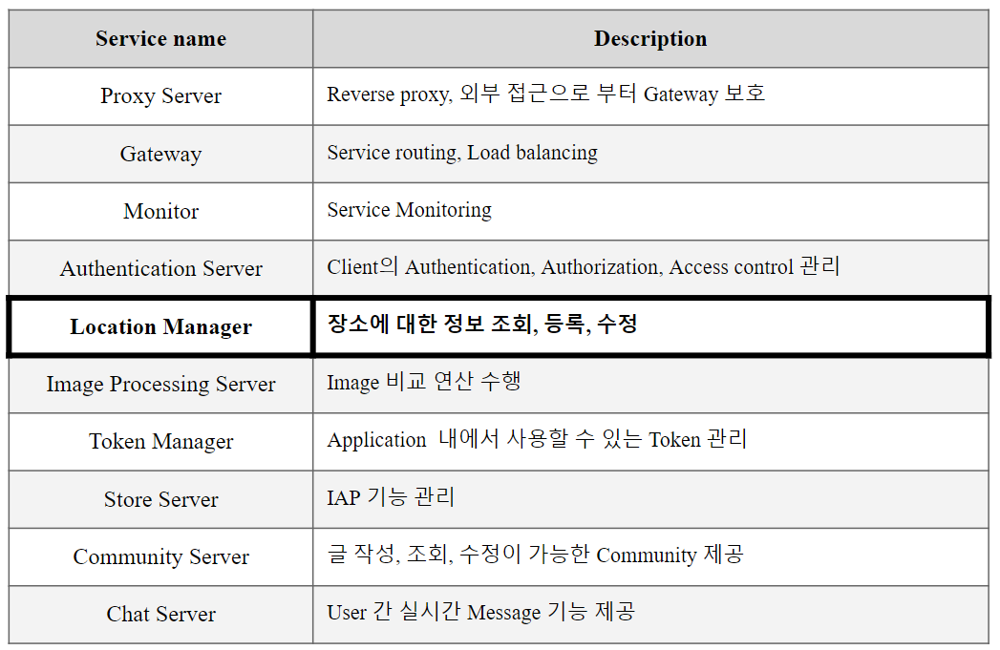

# Capstone Design Project / Any Where Map
이 저장소는 AWM v2의 지도 관련 저장소입니다.

## 0. Location Manager 소개
장소에 대한 정보를 조회하거나 등록, 수정 등을 위한 기능을 제공합니다.  
API, DB 등 자세한 정보는 '/doc' 폴더의 문서를 참고하십시오.

## 1. 저장소 분류
|저장소|설명|URL|
|:---|:---|:---|
|awm-v2-backend-meta|awm-v2의 모든 서비스 정보를 볼 수 있습니다.|[link](https://github.com/ahr-i/awm-v2-backend-meta)|

'awm-v2-backend-meta'에서 awm-v2의 모든 서비스 정보를 볼 수 있습니다.  
meta 저장소에서 1번 항목의 '저장소 분류' 목록을 참고하십시오.

## 2. 아키텍처

